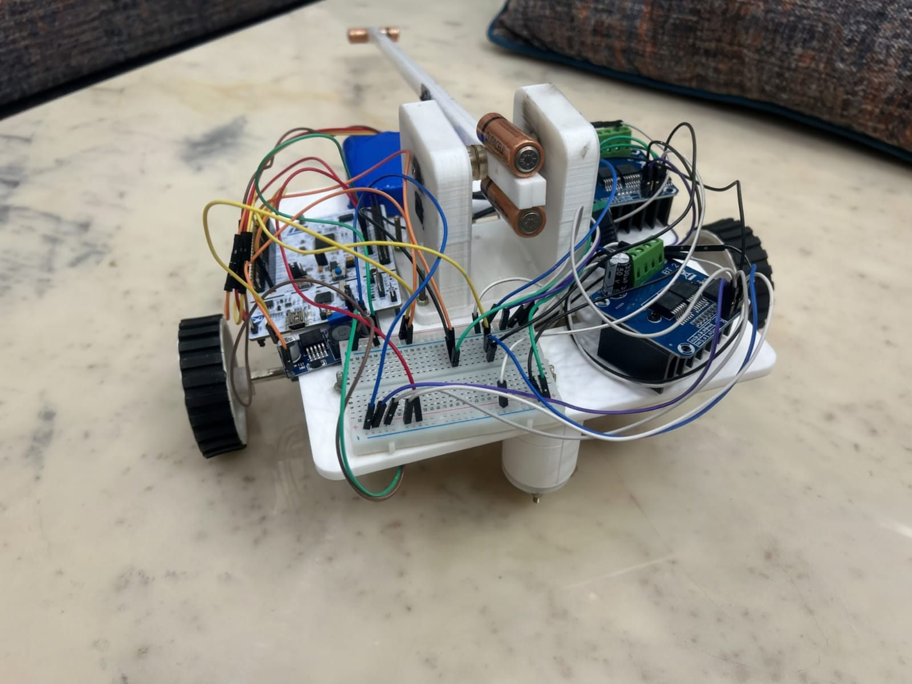

# STM32 Self-Balancing Inverted Pendulum

## Overview

This repository implements a self-balancing inverted pendulum mounted on a cart using an STM32 microcontroller, an MPU6050 IMU, and BTS7960 motor drivers. The system continuously estimates the pendulum angle and applies corrective motor commands to keep the pendulum upright in real time.

An inverted pendulum on a cart is a classic control problem: a pendulum that is unstable when upright is balanced by moving the cart beneath its pivot to keep the center of mass over the wheelbase. The diagram below illustrates the basic setup and concept.


## Features

- Real-time angle estimation using MPU6050 accelerometer and gyroscope
- Complementary filter for sensor fusion
- PD (Proportional-Derivative) controller for stabilization
- High-frequency control loop (~500 Hz)
- Bidirectional motor control using BTS7960 motor drivers
- PWM generation using STM32 TIM1 hardware timers
- Fall detection and motor shutdown safety mechanism
- UART debugging interface

## Hardware

- MCU: STM32F401RE (CubeMX + HAL)
- Sensor: MPU6050 (I2C)
- Motor driver: BTS7960 (high-current H-bridge)
- Actuators: DC gear motors attached to a cart

## System Architecture

MPU6050 → STM32F401RE → PD Controller → PWM Output → BTS7960 → Motors

The MPU6050 provides accelerometer and gyroscope measurements. A complementary filter fuses these signals to produce a stable angle estimate. The PD controller computes a corrective command, which is converted to PWM and sent to the motor driver.

## Control Algorithm

### Sensor Fusion

We use a complementary filter to combine short-term gyroscope information with long-term accelerometer stability:

angle = 0.98 × (angle + gyro_rate × dt) + 0.02 × acc_angle

### PD Controller

Control law used in the project:

u = Kp × θ + Kd × θ̇

Where θ is the pendulum angle and θ̇ is the angular velocity. The controller output is converted into PWM and direction for bidirectional motor actuation.

## Safety

- Motor shutdown when the pendulum angle exceeds a safe threshold
- PWM saturation limits to prevent over-driving the motors
- I2C recovery (re-initialize on read errors)
- Direction change protection to avoid jerky zero-crossing behavior

## Results

The current implementation reads the MPU6050, estimates the angle, and attempts to balance the pendulum using a PD controller. With tuning, the system can balance for short durations and demonstrates the complete control loop on hardware.

## Media

Below are placeholder images illustrating the build, wiring, and runtime behavior. Replace these with your real photos by uploading them to `docs/images/` with the same filenames.




## Build & Flash (Windows)

1. Ensure `cmake`, `gcc-arm-none-eabi`, and a programmer (ST-Link/OpenOCD) are installed.
2. From project root:

```powershell
mkdir build
cd build
cmake -DCMAKE_TOOLCHAIN_FILE=cmake/gcc-arm-none-eabi.cmake ..
cmake --build . --config Release
```

Flash using `flash.bat` or your preferred programmer.

## Files of Interest

- `Core/Src/main.c` — main control loop, IMU reads, complementary filter, PD controller
- `CMakeLists.txt` and `cmake/gcc-arm-none-eabi.cmake` — build configuration
- `flash.bat` — Windows flash helper script

## Future Work

- Full PID controller and tuned gains
- Kalman filter or sensor-fusion improvements
- Wheel encoders for closed-loop cart control
- Mechanical improvements and power management

## Author

Utkarsh Gaur

## License

MIT
